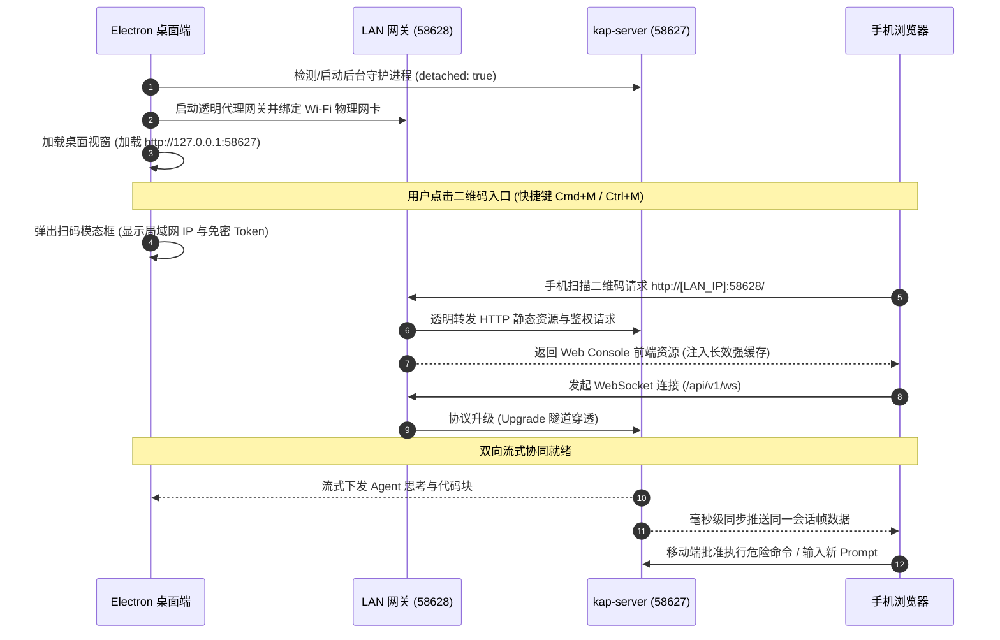

<p align="center">
  <a href="./README_EN.md">English</a> | <strong>简体中文</strong>
</p>

<p align="center">
  
  
  
  
  
</p>

<h1 align="center">Kimi Code Desktop (macOS / Windows 原生桌面版)</h1>

<p align="center">
  <strong>基于 Electron 与原生 macOS / Windows 视窗技术构建，深度致敬 ZCode 移动协同理念打造的 Kimi Code 桌面客户端。</strong><br>
  集成 <strong>Mobile Companion 手机扫码双向同步协同</strong>、<strong>独立脱离终端系统级守护进程</strong> 与 <strong>看门狗自愈机制</strong>。
</p>

---

## 📖 项目概述 (Project Overview)

**Kimi Code Desktop** 是一款专为 macOS 与 Windows 10/11 打造的高性能原生桌面客户端。传统的命令行 CLI 或浏览器网页使用方式，往往面临终端视窗杂乱、意外关闭终端导致任务中断、工位离开时无法实时跟进任务等痛点。

本项目借鉴 **ZCode** 优秀的人机交互与移动伴侣理念，将 Kimi Code 强大的编码与 Agent 能力打包进高度定制的原生跨平台桌面应用中：
- **桌面级沉浸体验**：macOS 原生交通灯融合（`hiddenInset`）与 Windows 11 原生无边框控制按钮（`titleBarOverlay`），深浅色模式自动同步，视窗状态持久化记忆。
- **跨屏移动伴侣（Mobile Companion）**：电脑端一键生成高清局域网免密二维码，智能过滤虚拟网卡与代理回环，手机扫码即连，随时随地在手机浏览器上掌控 Agent 思考过程、审批高危命令并流式对话。
- **高可用后台架构**：内嵌系统级独立守护进程与看门狗自动拉起机制，Windows 下支持 `windowsHide: true` 静默无黑框后台运行，即使关闭桌面视窗或关闭终端，后台编译与服务依然稳健运行。

---

## ✨ 核心特性矩阵 (Detailed Features)

### 🖥️ 原生跨平台视窗与桌面级沉浸体验
* **macOS `hiddenInset` 原生交通灯融合**：遵循 Apple 界面设计语言（HIG），红黄绿原生视窗控制按钮精准嵌入侧边栏顶部（`x: 16, y: 16`），消除了传统视窗标题栏的生硬割裂感。
* **Windows 10/11 原生无缝沉浸视窗（titleBarOverlay）**：针对 Windows 10/11 深度定制原生标题栏控制按钮组（`titleBarOverlay: { color: '#09090b', symbolColor: '#a1a1aa', height: 35 }`），最小化、最大化、关闭控件与侧边栏无缝衔接，完美告别传统视窗标题栏的生硬黑白边界。
* **深浅色主题自适应同步（Dark/Light Auto-Sync）**：深度对接 Electron `nativeTheme` 与前端主题接口，实时随系统或应用内切换深色/浅色配色，彻底消除早期版本因缺失 `setTheme` 导致历史会话抛出 `TypeError` 的兼容缺陷。
* **视窗状态持久化记忆（Window State Persistence）**：基于 `userData/window-state.json` 自动记录窗口位置坐标（`x, y`）与视窗宽高，重启应用时精确还原至上次工作状态。
* **系统托盘常驻与后台待机（System Tray & Keep-Alive）**：点击红点关闭主窗口时自动退隐到系统托盘（macOS 状态栏或 Windows 任务栏通知区域），图标根据操作系统自动适配（macOS 模板图标 / Windows 彩色应用图标），WebSocket 与后台会话保持存活，手机端扫码连接绝不中断。

### 📱 手机扫码伴侣与局域网跨屏协同 (Mobile Companion Remote Sync)
* **零配置开箱即用（Zero Configuration）**：无需在同一局域网中手动查找并输入复杂的 IP 或端口号，也无需配置外部公网中转服务器。
* **智能物理网卡探测与虚拟网卡过滤（LAN Auto-Discovery）**：底层智能过滤 Clash、Surge、Docker、UTUN、TUN、TAP 等虚拟网卡及 `198.18.0.0/15` 代理回环段，更深度适配 Windows 平台，自动识别并过滤 Hyper-V（`vEthernet`）、WSL、VMware、VirtualBox、Tailscale、ZeroTier 等虚拟网卡；智能高优先级匹配真实物理网卡（macOS `en0`，Windows `WLAN`、`Wi-Fi`、`以太网`、`Ethernet` 等），确保手机扫码秒连。
* **高对比度原生极速扫码浮层（QR Code Modal）**：原生轻量扫码窗口（快捷键 `Cmd + M` / `Ctrl + M` 或左下角入口随时唤起），采用 7% 低纠错率稀疏大点阵、280px 超清点阵并附带 4 模块纯白安全区（Quiet Zone），手机自带系统相机或微信实现 0.1 秒极速对焦与秒级解码。
* **双向流式帧同步（WebSocket Bidirectional Sync）**：手机浏览器与桌面客户端同时订阅相同的会话通道，Agent 思考过程（Thinking Process）、代码 Diff、命令行执行结果实时流式投影到手机屏幕；手机端亦可直接下达全新 Prompt 或审批高风险操作。

### 🛡️ 脱离终端的系统级守护进程与看门狗自愈 (Detached Daemon & Watchdog)
* **彻底脱离终端生命周期（Detached Lifecycle）**：采用 `detached: true` 与独立的 stdio 文件流启动核心 `kap-server`，日志独立持久化至 `~/.kimi-code/logs/desktop-daemon.log`。关闭打开的终端、退出 IDE 均不会杀掉后台服务。
* **Windows 静默守护与防黑框弹出（windowsHide: true）**：在 Windows 平台通过 `windowsHide: true` 实现纯后台静默守护，彻底杜绝拉起守护进程时黑色 CMD 终端窗口闪烁或弹出的烦恼；智能识别 `.cmd` / `.bat` 脚本并适配系统 Shell 调度。
* **看门狗巡检与崩溃平滑自愈（Watchdog & Auto-Heal）**：内置 5 秒高可用健康巡检定时器，持续轮询 `/api/v1/meta`；一旦核心服务异常退离，看门狗自动触发平滑自愈拉起。
* **透明代理网关与动态端口避让（Smart Gateway & Fallback）**：默认监听 `58628` 端口，若遇端口占用则自动递增顺延重试；内部代理统一重写真实 Host 与 Origin，自动规避跨域（CORS）与 DNS-Rebinding 限制。

### ⚡ 100% 完整继承 Kimi Code 官方全量能力
* **完整工作区与历史会话**：支持 Workspace 会话固定（Pin/Unpin）、历史对话无缝加载与多会话切换。
* **全功能 Agent 工具链调用**：原生支持 Bash 命令行执行、智能 Grep/Glob 全局搜索、文件读写、Web 检索、多轮工具调用与自省修复。
* **无干扰界面深度优化**：自动剥离右上角内部测试标签（`.internal-build`），并在侧边栏左下角原生注入手机伴侣呼出入口。

### 🚀 底层渲染与网络缓存深度调优
* **Chromium 硬件加速**：启动阶段注入 `--enable-gpu-rasterization` 与 `--enable-zero-copy` 参数，消除高刷新率屏幕滚动代码时的掉帧与卡顿。
* **500MB 高速本地磁盘缓存**：配置 `--disk-cache-size=524288000` 并对静态 Web 资源注入 `immutable` 强缓存头，实现工作台与编辑器组件毫秒级秒开。
* **V8 堆内存调优**：配置 `--max-old-space-size=4096`，充分满足超长上下文对话与海量代码渲染时的内存需求。

---

## 🏗️ 系统架构与数据流 (Architecture & Data Flow)

### 模块拓扑架构

```
+---------------------------------------------------------------------------------+
|                            macOS / Windows 桌面客户端                            |
|                                                                                 |
|  +---------------------------------------------------------------------------+  |
|  |                    Electron Main Process (主进程)                         |  |
|  |  • Window Lifecycle (hiddenInset / titleBarOverlay) • Application Menu    |  |
|  |  • Tray Manager (macOS 状态栏 / Win 托盘)   • Window State Persistence    |  |
|  |  • Chromium GPU Acceleration               • Watchdog Auto-Heal Controller|  |
|  +---------------------------------------------------------------------------+  |
|       │                                              │                          |
|       │ IPC Bridge (Preload.cjs)                     │ Spawns & Supervises      |
|       ▼                                              ▼                          |
|  +-------------------------+            +------------------------------------+  |
|  |  Electron Renderer     |            |  System Daemon (kap-server)        |  |
|  |  • Vue 3 / Web Console  |            |  • DI x Scope Agent Engine         |  |
|  |  • Desktop Bridge API   |            |  • Port: 58627 (Core HTTP / WS)    |  |
|  |  • Cleaned UI Styles    |            |  • Detached Process Group          |  |
|  +-------------------------+            +------------------------------------+  |
|                                                      ▲                          |
|                                                      │ HTTP / WS Proxy          |
|                                         +------------------------------------+  |
|                                         |  Local LAN Gateway (网关代理)      |  |
|                                         |  • Port: 58628 (透明代理 / CORS 注入) |  |
|                                         |  • Host Rewrite & Token Injection  |  |
|                                         +------------------------------------+  |
|                                                      ▲                          |
+------------------------------------------------------┼--------------------------+
                                                       │ Wi-Fi 局域网传输
                                                       ▼
                                          +------------------------------------+
                                          |  Mobile Companion (移动端伴侣)     |
                                          |  • iOS Safari / Android Chrome     |
                                          |  • 扫码免密加载 (Hash Token)       |
                                          |  • 实时双向帧同步 / 移动审批操作   |
                                          +------------------------------------+
```

### 业务交互时序流



---

## 🚀 快速启动 (Quick Start)

### 方式 0：直接下载预编译安装包（最简便 · 推荐）

前往 **[GitHub Releases 最新发布页](https://github.com/laoniubia/kimi-code-desktop/releases/latest)** 直接下载编译好的各平台原生安装包：

#### 🍏 macOS (Apple Silicon & Intel)
* 📥 **`Kimi Code-1.0.0-arm64.dmg`**：Apple Silicon (M1/M2/M3/M4) 原生安装镜像，双击拖入「应用程序」文件夹即装即用。
* 📦 **`Kimi-Code-1.0.0-mac-arm64.zip`**：便携免安装压缩包，解压即可运行。

> **macOS 提示**：首次打开若遇 macOS 安全提示“无法验证开发者”，在终端中执行一行命令即可消除隔离标记：
> ```bash
> xattr -cr "/Applications/Kimi Code.app"
> ```

#### 🪟 Windows (Windows 10 / 11 64位)
* 📥 **`Kimi-Code-Setup-1.0.0.exe`**：标准 Windows NSIS 安装包。支持自定义安装目录、自动创建桌面快捷方式与开始菜单磁贴，一键完成安装。
* 📦 **`Kimi-Code-1.0.0-win-x64.zip`**：绿色便携版免安装压缩包。解压到任意目录，双击 `Kimi Code.exe` 即可直接运行，不写入系统注册表。

> **Windows 提示**：
> 1. **SmartScreen 提示**：首次运行未经微软昂贵代码签名的可执行文件时，若弹出“Windows 已保护你的电脑 (SmartScreen)”，点击「更多信息」->「仍要运行」即可。
> 2. **局域网防火墙放行**：初次启动若弹出 Windows Defender 防火墙警告，请勾选「专用网络（例如家庭或工作网络）」并点击「允许访问」，以便手机扫码后正常连接局域网代理网关。

---

### 环境依赖准备 (源码运行/二次开发)
* **操作系统**：macOS 12.0+ (支持 Apple Silicon arm64 与 Intel x64) 或 Windows 10 / 11 (x64)
* **Node.js**：>= 20.0.0 或 **Bun** >= 1.4.0
* **Kimi Code 核心**：本地已安装或全局 link 的 Kimi Code CLI（如 `npm i -g @moonshot-ai/kimi-code`，Windows 自动适配 `kimi.cmd` 与系统 PATH）

---

### 方式 1：双击一键运行 (从源码)

项目根目录内置了全自动环境感知启动脚本：

```bash
chmod +x ./start.sh
./start.sh
```

> **运行机制说明**：`start.sh` 具备智能三级降级判定：
> 1. 若 `/Applications/Kimi Code.app` 已安装，优先调起已安装的独立应用程序；
> 2. 若 `release/` 目录存在已打包的编译产物，直接调起打包产物；
> 3. 若为初次源码运行，将自动执行 `scripts/build.mjs` 编译主进程并以脱离终端模式拉起应用。启动后即可直接关闭终端！

---

### 方式 2：使用包管理器开发调试

推荐使用 **npm**（依赖由已固化的 `package-lock.json` 严格锁定，构建确定性最高），同时兼容 **bun**：

```bash
# 1. 安装项目依赖
npm install
# (或 bun install)

# 2. 启动开发模式 (热重载与终端前台输出日志)
npm run dev

# 3. 亦可通过 start.sh 带参进入开发者模式
./start.sh --dev
```

---

### 🧪 开发质量检查与测试套件

在提交或打包前，可以通过内置的质量保证脚本对桌面端进行全量验证：

```bash
# TypeScript 严格类型检查 (基于 tsconfig.json，不输出产物)
npm run typecheck

# 运行完整自动化测试链路 (服务连通性 + 移动端扫码握手模拟)
npm run test
```

测试命令拆解：
* **`npm run test:services`**：启动并验证本地核心服务健康探针（`/api/v1/meta`）、Token 抓取有效性以及二维码 DataURL 生成有效性。
* **`npm run test:handshake`**：模拟移动端从局域网网关请求主页 HTML 及升级建立 WebSocket（`/api/v1/ws`）的全流程通信握手。

---

## 📱 手机远程伴侣扫码配对指南 (Mobile Pairing Guide)

只需简单三步，即可将手机变成随身携带的 Kimi Code 遥控终端：

```
+------------------+       +------------------+       +------------------+
|  步骤 1: 网络确认 | ----> |  步骤 2: 呼出二维码 | ----> |  步骤 3: 扫码即连  |
| 手机与电脑同Wi-Fi |       |  点击图标/Cmd+M   |       | 相机扫码免密加载   |
+------------------+       +------------------+       +------------------+
```

1. **统一网络**：确保 iPhone / Android 手机与电脑（Mac / Windows PC）连接在 **同一个 Wi-Fi 无线网络** 下。
2. **呼出二维码**：
   * 点击桌面客户端侧边栏左下角的 **手机图标**；
   * 或在任何时候按下系统快捷键 **`Cmd + M` (macOS) / `Ctrl + M` (Windows)**；
   * 或点击顶部菜单栏 `文件 -> 手机扫码连接...`。
3. **极速扫码**：
   * 打开手机自带 **系统相机**、**微信** 或任何浏览器扫一扫；
   * 对准屏幕上的二维码，点击弹出的网页链接；
   * 页面将通过 `#token=...` hash 机制完成无感免密认证，即刻进入工作台！
4. **协同交互**：
   * 离开电脑去冲咖啡？带上手机，实时观察 Agent 的代码思考链与修改进度；
   * 遇到需要授权执行的高风险 Bash 命令？直接在手机屏幕上一键点击「允许执行」；
   * 突然有新灵感？在手机端打字发送补充要求，桌面端实时响应！

---

## 📦 应用打包与分发 (Packaging & Distribution)

本项目采用 `esbuild` 进行极速构建，并集成 `electron-builder` 产出符合 macOS 与 Windows 规范的专业级应用产物：

```bash
# 1. 编译并打包 macOS 可执行应用文件夹 (.app)
npm run dist:mac

# 2. 编译并构建 macOS 便携安装镜像 (.dmg)
npm run dist:dmg

# 3. 编译并构建 Windows NSIS 安装包 (.exe) 与便携版
npm run dist:win
```

### 打包产物说明
打包产物位于 `release/` 目录：
* **macOS 产物**：
  * **`release/mac-arm64/Kimi Code.app`**：适用于 Apple Silicon（M1/M2/M3/M4 系列芯片）的独立应用程序。
  * **`release/Kimi Code-1.0.0-arm64.dmg`**：具备标准拖拽安装交互的 macOS 磁盘映像。
* **Windows 产物**：
  * **`release/Kimi-Code-Setup-1.0.0.exe`**：标准 NSIS Windows 安装程序（支持一键安装、自定义安装目录与创建桌面快捷方式）。
  * **`release/win-unpacked/`** 与便携压缩包：解压即用的绿色便携版本。

### 应用安装建议
* **macOS**：双击打开生成的 `.dmg` 文件，将 **Kimi Code.app** 拖入 `/Applications`（应用程序）文件夹即可完成安装。
* **Windows**：双击运行生成的 `Kimi-Code-Setup-1.0.0.exe`，按安装向导指引完成安装；或直接运行便携版目录下的 `Kimi Code.exe`。

---

## 🛠️ 故障排查与常见问题 (Troubleshooting & FAQ)

### Q1: 手机扫码后网页提示连接超时或无法打开？
* **Wi-Fi 隔离检查**：部分企业网络或公共 Wi-Fi 开启了 **AP 隔离（Client Isolation）**，导致局域网设备间无法互相通信。请尝试连接家庭 Wi-Fi 或使用手机开启个人热点供电脑连接测试。
* **网络代理/VPN/虚拟网卡**：如果电脑上开启了全局代理客户端（如 Clash、Surge、Sing-box 等），虚拟网卡可能导致局域网流量被路由劫持。
  * 本应用已内置自动过滤 macOS（`utun*`、`tun*`）与 Windows（Hyper-V `vEthernet`、WSL、TAP、Tailscale 等）及 `198.18.*` 代理网段；
  * Windows 用户请确认 Windows Defender 防火墙已放行 Kimi Code 的「专用网络」入站连接；
  * 请确保手机端未配置阻断内网私网地址（`192.168.*`）的代理规则，建议将局域网 IP 加入直连白名单。

### Q2: 提示端口冲突（EADDRINUSE 58627 或 58628）？
* **网关自动容错**：若 `58628` 网关端口被占用，程序会自动尝试 `58629`、`58630` 并自动更新扫码二维码。
* **核心服务排查**：若 `58627` 被第三方程序占用，可在终端中排查并释放端口：
  ```bash
  # macOS / Linux
  lsof -i :58627
  kill -9 <PID>

  # Windows (PowerShell)
  Get-NetTCPConnection -LocalPort 58627
  Stop-Process -Id <PID> -Force
  ```

### Q3: 打开应用提示“已损坏，无法打开”或“Windows 已保护你的电脑”？
* **macOS Gatekeeper**：出现此提示是由于 macOS 对未签署 Apple Developer 商业证书的开源构建包的安全拦截。在终端运行以下命令移除隔离属性即可：
  ```bash
  xattr -cr "/Applications/Kimi Code.app"
  ```
* **Windows SmartScreen**：由于未包含昂贵的商业代码签名证书，首次运行时 Windows Defender SmartScreen 会提示拦截，点击「更多信息」-> 选择「仍要运行」即可正常启动。

### Q4: 关闭窗口后，后台任务还在运行吗？
* **是的，完全不受影响**。点击主窗口关闭时，窗口仅被隐藏（Hide），核心引擎作为 Detached 系统守护进程在后台常驻并受看门狗监控（Windows 下具备 `windowsHide: true` 静默无黑框后台守护）。如需彻底退出应用，请在状态栏/任务栏托盘或主菜单中选择 **「彻底退出 Kimi Code」**（或使用 `Cmd + Q` / `Ctrl + Q`）。

### Q5: 二维码为什么识别速度极快？
* 二维码算法配置了 **`errorCorrectionLevel: 'L'`**（7% 纠错等级）。根据 QR 规范，在屏幕显示场景下无需物理抗损的高容错率，降为 L 级可以使点阵矩阵显著稀疏化，配合内置的 4 模块 Quiet Zone 白边，使得手机摄像头在弱光或小角度下也能在 0.1 秒内迅速锁定对焦。

---

## 🤝 贡献与开源协议 (Contributing & License)

### 参与贡献
欢迎提交 Issue 报告使用问题或提出特性需求！如果您希望改进桌面版交互，请遵循以下流程：
1. Fork 本代码仓库；
2. 新建特性分支 (`git checkout -b feat/my-cool-feature`)；
3. 提交您的修改 (`git commit -m 'feat: add some cool feature'`)；
4. 推送分支至远端并提交 Pull Request。

### 致谢
- **[Moonshot AI](https://moonshot.ai)**：提供强大的 Kimi 模型与 Kimi Code 开源架构基石。
- **ZCode**：为本项目提供了极具启发性的移动协同理念与桌面视窗交互范式。

### 许可证
本项目基于 [MIT License](./LICENSE) 许可证开源，自由分享，共同演进。
