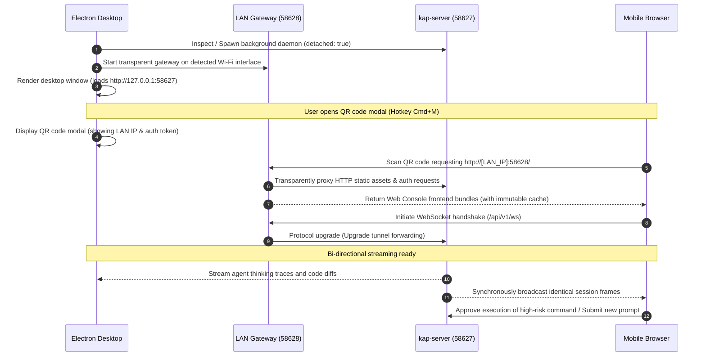

<p align="center">
  <strong>English</strong> | <a href="./README.md">简体中文</a>
</p>

<p align="center">
  
  
  
  
  
</p>

<h1 align="center">Kimi Code Desktop for macOS</h1>

<p align="center">
  <strong>A standalone, high-performance native macOS desktop client for Kimi Code, inspired by ZCode's cross-screen collaboration paradigm.</strong><br>
  Featuring <strong>Mobile Companion QR Code bidirectional sync</strong>, a <strong>detached headless system daemon</strong>, and <strong>watchdog auto-heal resilience</strong>.
</p>

---

## 📖 Project Overview

**Kimi Code Desktop** brings the power of the Kimi Code AI coding agent from command-line terminals and detached browser tabs into an elegant, native macOS desktop environment. Traditional CLI workflows often suffer from cluttered terminal windows, accidental process termination upon shell exit, and the inability to supervise or interact with ongoing tasks when stepping away from the desk.

Inspired by **ZCode's** user interaction model and mobile companion ergonomics, this project packages Kimi Code's reasoning, tool-use, and coding capabilities into a deeply integrated native macOS application:
- **Immersive Desktop UX**: Borderless native window with traffic light integration (`hiddenInset`), automatic light/dark theme adaptation, and persistent window state memory.
- **Mobile Companion Sync**: Generate high-definition, authenticated local Wi-Fi QR codes with one click. Scan using any smartphone browser to observe agent reasoning, inspect streaming code diffs, approve sensitive bash commands, and prompt tasks remotely.
- **High-Availability Daemon**: Powered by a detached headless daemon and an active 5-second health-monitoring watchdog. Background builds and agent sessions survive window closures and terminal terminations without interruption.

---

## ✨ Detailed Features

### 🖥️ Native macOS Window & Desktop Ergonomics
* **`hiddenInset` Traffic Light Integration**: Follows Apple's Human Interface Guidelines (HIG), seamlessly embedding native red-yellow-green window controls into the sidebar header (`x: 16, y: 16`) to eliminate artificial title bar boundaries.
* **Dark / Light Theme Auto-Sync**: Bridges Electron's `nativeTheme` directly into frontend theme tokens, seamlessly switching alongside macOS system appearance or user settings. Fixes compatibility regressions where missing `setTheme` handlers caused `TypeError` exceptions on historical session loading.
* **Window State Persistence**: Automatically persists window dimensions, screen coordinates (`x, y`), and maximize states to `userData/window-state.json`, restoring exact geometries upon next launch.
* **System Tray (Menu Bar) Resident**: Closing the main window via the red traffic light parks the application in the macOS top menu bar with an adaptive monochrome template icon (`trayTemplate.png`). The background WebSocket session remains alive and mobile connections never drop.

### 📱 Mobile Companion Remote Sync (ZCode Style)
* **Zero Configuration**: No manual IP lookup, port forwarding, or public relay servers required. Works completely over your local Wi-Fi router or mobile hotspot.
* **Smart Physical Network Adapter Discovery**: Intelligently inspects network interfaces, automatically filtering out virtual network adapters (Clash, Surge, Docker, UTUN, TUN, TAP) and `198.18.0.0/15` proxy ranges. Prioritizes genuine physical adapters (`en0`, `192.168.x.x`, `10.x.x.x`, `172.x.x.x`).
* **High-Contrast Rapid QR Code Modal**: Lightweight native modal (accessible via `Cmd + M` or bottom-left sidebar button). Employs low error-correction overhead (`Level L`), 280px ultra-clear raster, and a 4-module pure white quiet zone, enabling smartphones to lock focus and decode within 0.1 seconds.
* **Bidirectional Streaming WebSocket Sync**: Mobile browsers and desktop windows subscribe to identical session event streams. Thinking traces, code generation blocks, and terminal stdout/stderr stream simultaneously; mobile users can prompt tasks or grant execution permissions in real time.

### 🛡️ Detached System Daemon & Watchdog Auto-Heal
* **Detached Lifecycle**: Spawns the underlying `kap-server` core using `detached: true` and dedicated file descriptor stdio streams (`~/.kimi-code/logs/desktop-daemon.log`). Closing terminal windows, quitting IDEs, or killing parent shells will never terminate your agent server.
* **Watchdog Continuous Health Check**: A 5-second background health supervisor continuously polls `/api/v1/meta`. If the core process terminates unexpectedly, the watchdog automatically and smoothly respawns the daemon.
* **Smart Gateway & Dynamic Port Fallback**: Binds to port `58628` by default and transparently proxies HTTP and WebSocket connections to core port `58627`. Automatically increments to `58629+` on port collision and rewrites Host/Origin headers to prevent CORS and DNS-rebinding restrictions.

### ⚡ 100% Full Official Capabilities
* **Workspace Sessions & History**: Full support for conversation pinning/unpinning, multi-session switching, and seamless history reloading.
* **Complete Agent Tool Calling**: Native execution of Bash commands, intelligent ripgrep/glob workspace search, file read/write/edit, web fetching, and multi-turn iterative self-repair.
* **Distraction-Free UI**: Automatically cleans up internal build watermarks (`.internal-build`) while natively injecting the mobile companion entrypoint into the sidebar footer.

### 🚀 Performance & Network Optimizations
* **Chromium Hardware Acceleration**: Injects `--enable-gpu-rasterization` and `--enable-zero-copy` at launch, ensuring zero-lag 120Hz ProMotion scrolling across huge diff files and syntax-highlighted code.
* **500MB Dedicated Disk Cache**: Preconfigured with `--disk-cache-size=524288000` alongside `immutable` HTTP cache headers on static assets for sub-second interface startup.
* **V8 Heap Optimization**: Sets `--max-old-space-size=4096` to smoothly handle long-context reasoning chains and massive repository indexing operations.

---

## 🏗️ Architecture & Data Flow

### Module Topology

```
+---------------------------------------------------------------------------------+
|                                macOS Desktop Client                             |
|                                                                                 |
|  +---------------------------------------------------------------------------+  |
|  |                    Electron Main Process                                  |  |
|  |  • Window Lifecycle (hiddenInset borderless)  • Native Application Menu   |  |
|  |  • Tray Manager (macOS System Menu Bar)      • Window State Persistence   |  |
|  |  • Chromium GPU Acceleration Switches        • Watchdog Auto-Heal Super   |  |
|  +---------------------------------------------------------------------------+  |
|       │                                              │                          |
|       │ IPC Bridge (Preload.cjs)                     │ Spawns & Supervises      |
|       ▼                                              ▼                          |
|  +-------------------------+            +------------------------------------+  |
|  |  Electron Renderer     |            |  System Daemon (kap-server)        |  |
|  |  • Vue 3 / Web Console  |            |  • DI x Scope Agent Engine         |  |
|  |  • Desktop Bridge API   |            |  • Port: 58627 (Core HTTP / WS)    |  |
|  |  • Cleaned UI Styles    |            |  • Detached Process Group          |  |
|  +-------------------------+            +------------------------------------+  |
|                                                      ▲                          |
|                                                      │ HTTP / WS Proxy          |
|                                         +------------------------------------+  |
|                                         |  Local LAN Gateway                 |  |
|                                         |  • Port: 58628 (Transparent Proxy) |  |
|                                         |  • Host Rewrite & Token Injection  |  |
|                                         +------------------------------------+  |
|                                                      ▲                          |
+------------------------------------------------------┼--------------------------+
                                                       │ Wi-Fi LAN Connection
                                                       ▼
                                          +------------------------------------+
                                          |  Mobile Companion Client           |
                                          |  • iOS Safari / Android Chrome     |
                                          |  • Zero-Login Ingestion (#token)   |
                                          |  • Bi-directional Stream & Approvals
                                          +------------------------------------+
```

### Sequence Flow



---

## 🚀 Quick Start

### Method 0: Download Pre-built Release (Easiest · Recommended)

Visit the **[GitHub Releases Latest Page](https://github.com/laoniubia/kimi-code-desktop/releases/latest)** to download ready-to-use macOS binaries:
* 📥 **`Kimi Code-1.0.0-arm64.dmg`**: Native macOS installer for Apple Silicon (M1/M2/M3/M4). Drag and drop into `/Applications`.
* 📦 **`Kimi-Code-1.0.0-mac-arm64.zip`**: Portable archive. Extract and double-click to launch.

> **Note**: If macOS Gatekeeper alerts "App cannot be opened because developer cannot be verified", run this command in terminal to clear the quarantine flag:
> ```bash
> xattr -cr "/Applications/Kimi Code.app"
> ```

---

### Prerequisites (Source Run / Development)
* **Operating System**: macOS 12.0+ (Universal: Apple Silicon arm64 & Intel x64)
* **Node.js**: >= 20.0.0 or **Bun** >= 1.4.0
* **Kimi Code Core**: Globally installed (`npm i -g @moonshot-ai/kimi-code`) or built from source

---

### Method 1: One-Click Launch Script (From Source)

A smart environment-aware launch script is included in the project root:

```bash
chmod +x ./start.sh
./start.sh
```

> **Execution Logic**: `start.sh` implements an automated three-tier fallback:
> 1. If `/Applications/Kimi Code.app` exists, it immediately launches the installed application;
> 2. If a packaged `.app` exists in `release/`, it opens that build artifact;
> 3. If launching from raw source for the first time, it runs `scripts/build.mjs` and launches the application in detached background mode. You can safely close your terminal right away!

---

### Method 2: Package Manager Workflow

**npm** is recommended for deterministic installs (`package-lock.json` is checked into version control). **bun** is also fully supported:

```bash
# 1. Install dependencies
npm install
# (or bun install)

# 2. Launch in development mode (hot-reloading & live terminal logs)
npm run dev

# 3. Alternatively run start.sh with the --dev flag
./start.sh --dev
```

---

### 🧪 Testing & Verification Suite

Before submitting pull requests or packaging builds, run the automated verification suite:

```bash
# TypeScript strict type checking (based on tsconfig.json, noEmit)
npm run typecheck

# Execute full automated test pipeline (services + mobile web handshake)
npm run test
```

Individual test targets:
* **`npm run test:services`**: Verifies core daemon probe health (`/api/v1/meta`), security token retrieval, and QR Code DataURL generation.
* **`npm run test:handshake`**: Simulates a mobile client requesting the root HTML page and upgrading to WebSocket (`/api/v1/ws`).

---

## 📱 Mobile Pairing Guide

Turn your smartphone into a remote control terminal in three simple steps:

```
+---------------------+       +---------------------+       +---------------------+
|  Step 1: Network    | ----> |  Step 2: QR Modal   | ----> |  Step 3: Scan & Go  |
| Connect Same Wi-Fi  |       |  Click icon / Cmd+M |       | Native Camera Scan  |
+---------------------+       +---------------------+       +---------------------+
```

1. **Same Network**: Confirm your smartphone (iOS or Android) and Mac are connected to the **same Wi-Fi router or mobile hotspot**.
2. **Open QR Code**:
   * Click the **smartphone icon** at the bottom-left of the sidebar;
   * OR press the global shortcut **`Cmd + M`**;
   * OR select `File -> 📱 手机扫码连接...` from the macOS application menu.
3. **Instant Scan**:
   * Open your phone's native **Camera app**, WeChat, or QR-capable browser;
   * Point at the screen and tap the detected link;
   * The page transparently authenticates via `#token=...` hash injection, granting instant access without typing credentials!
4. **Interactive Collaboration**:
   * Stepping away for coffee? Bring your phone and follow code generation traces in real time;
   * Need to authorize a sensitive bash command? Tap "Allow" directly from your phone screen;
   * Got a new idea on the move? Type a follow-up prompt on your mobile keyboard to trigger instant desktop execution!

---

## 📦 Packaging & Distribution (.app / .dmg)

Built on top of `esbuild` and `electron-builder` to produce standards-compliant macOS release artifacts:

```bash
# 1. Compile source and assemble standalone application folder (.app)
npm run dist:mac

# 2. Compile source and generate drag-and-drop disk image (.dmg)
npm run dist:dmg
```

Output directory: `release/`
* **`release/mac-arm64/Kimi Code.app`**: Standalone application for Apple Silicon Macs (M1/M2/M3/M4).
* **`release/Kimi Code-1.0.0-arm64.dmg`**: Production-ready macOS drag-and-drop installer image.

### Installation
Double-click the generated `.dmg` file and drag **Kimi Code.app** into your `/Applications` folder.

---

## 🛠️ Troubleshooting & FAQ

### Q1: Mobile scanner displays connection timeout or fails to open?
* **Wi-Fi AP Isolation**: Some corporate or public Wi-Fi networks enable **Client Isolation (AP Isolation)**, preventing local peer-to-peer communication. Switch to a personal Wi-Fi network or enable a smartphone hotspot.
* **VPN / Proxy Interception**: If running a system-wide proxy on macOS (e.g. Clash, Surge, Sing-box), virtual TUN interfaces might route local traffic through proxy endpoints.
  * Kimi Code Desktop automatically filters `utun*`, `tun*`, and `198.18.*` addresses;
  * Verify that your mobile browser is not routing private IP addresses (`192.168.*`) through a proxy, and add local subnets to direct connection rules.

### Q2: Port conflict error (`EADDRINUSE 58627` or `58628`)?
* **Gateway Auto-Fallback**: If port `58628` is occupied, the gateway automatically shifts to `58629`, `58630`, etc., and updates the QR code target accordingly.
* **Core Daemon Conflict**: If port `58627` is occupied by an orphaned process, identify and terminate it:
  ```bash
  lsof -i :58627
  kill -9 <PID>
  ```

### Q3: App reports "damaged and can’t be opened" on first run?
* This occurs due to macOS Gatekeeper quarantine on open-source binaries built without paid Apple Developer certificates. Clear the quarantine flag via terminal:
  ```bash
  xattr -cr "/Applications/Kimi Code.app"
  ```

### Q4: Does background agent work continue after closing the window?
* **Yes, completely uninterrupted**. Clicking the red traffic light button hides the window while the detached daemon and watchdog continue running in the background. To quit completely, select **"彻底退出 Kimi Code" (Quit Kimi Code Completely)** from the menu bar tray or press `Cmd + Q`.

### Q5: Why is the QR code scanning speed so fast?
* The QR generator is tuned to **`errorCorrectionLevel: 'L'`** (7% error tolerance). Since computer screens provide clean pixel rendering, lower error overhead allows for a significantly sparser dot matrix. Combined with the 4-module white quiet zone, smartphone camera algorithms achieve sub-100ms auto-focus and decoding.

---

## 🤝 Contributing & License

### How to Contribute
Issues and pull requests are welcome! If you'd like to improve desktop features or mobile workflows:
1. Fork this repository;
2. Create a feature branch (`git checkout -b feat/my-cool-feature`);
3. Commit your changes (`git commit -m 'feat: add some cool feature'`);
4. Push to your branch and open a Pull Request.

### Acknowledgments
- **[Moonshot AI](https://moonshot.ai)**: For developing the exceptional Kimi model and open Kimi Code agent architecture.
- **ZCode**: For pioneering the inspirational mobile companion concept and desktop interaction patterns.

### License
This project is open-sourced under the [MIT License](./LICENSE).
